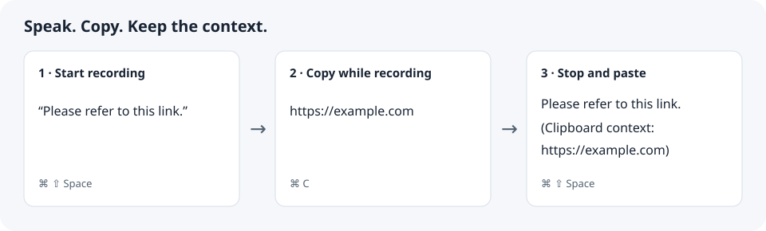

# SeaSnail

**面向 Mac 的本地语音听写工具。**说话、带入剪贴板上下文，将结果粘贴到你正在使用的应用。

[English](README.md) · 简体中文

SeaSnail 使用随应用交付的 Sherpa ONNX SenseVoice int8 运行时在本机识别语音。项目处于早期开发阶段，目前支持 **macOS 13+、Apple Silicon**。

## 主要功能

- 默认通过 **⌘ ⇧ Space** 开始和停止录音，可在设置中修改快捷键。
- 自动将结果粘贴到当前应用，支持剪贴板或会话历史降级。
- 录音期间复制文本、链接、文件或图片，把上下文带入听写结果。
- 本地加密会话历史与本机账户管理。
- 个人词典，以及可选的纠正与粘贴后修改学习。
- 使用自行配置的服务进行可选 AI 文本整理、编辑提示词和查看处理结果。
- 带权限范围的集成令牌、本机 OpenAPI 接口和数据导出。



剪贴板上下文开启后仅在录音期间采集。文本和链接进入组合结果，文件和图片以本地路径表示；可在「设置 → 隐私与权限」中调整。

## 隐私

录音、转写和剪贴板上下文在本地加密保存。本机账户保护当前设备的数据，无需注册在线服务。请妥善保管密码，退出登录后需要密码重新登录。

**AI 文本整理默认关闭。**启用后，转写正文与词典拼写提示会发送至你配置的服务；真实剪贴板上下文在请求前替换成不透明占位符，返回后在本地恢复。详见[隐私与权限说明](doc/privacy.zh-CN.md)。

## 安装与体验

可用构建见仓库的 [Releases](https://github.com/0Litost0/SeaSnail/releases)。请以具体版本的支持平台、签名状态和校验值为准；此处不代表已有公开二进制发布。也可以[从源码构建](doc/development.zh-CN.md)。

1. 打开 SeaSnail，创建本机账户。
2. 阅读用途后再授权：麦克风用于录音；辅助功能用于自动粘贴及相关修改学习。可以稍后配置。
3. 查看快捷键与剪贴板上下文使用指南。
4. 打开文本编辑器并放置光标，按 **⌘ ⇧ Space**，说一句话，再按一次结束。

当前构建脚本生成**未签名开发包**，包含开发专用的文件 Keychain fallback。公开分发需要单独完成发行评估，见[发布检查表](doc/releasing.md)。运行未签名版本前请阅读[安装说明](doc/install.zh-CN.md)。

## 本地开发

准备 Xcode Command Line Tools、Rust stable、pnpm 9+、Python 3 和受支持的 Node.js：22.x ≥22.22.2、24.x ≥24.15 或 26+。完整运行时构建还需 CMake、jq。

```sh
git clone https://github.com/0Litost0/SeaSnail.git
cd SeaSnail
python3 scripts/doctor.py --frontend-only
pnpm --dir apps/desktop install --frozen-lockfile
pnpm --dir apps/desktop generate:openapi
pnpm --dir apps/desktop typecheck
pnpm --dir apps/desktop test
pnpm --dir apps/desktop build
```

`pnpm --dir apps/desktop dev` 仅启动 UI；录音、全局快捷键、权限和 daemon IPC 需要原生 App。运行时准备、Rust 验证和打包方式见[中文开发指南](doc/development.zh-CN.md)（[English](doc/development.md)）。发布前的验证要求与剩余门禁见[发布清单](doc/releasing.md)。

## 架构

```text
React UI → 受限 Tauri IPC → 原生平台适配器
                              ↕ desktop-core 协调器
                          本机 Rust daemon
                              ↓
                       应用服务 → runtime → ASR sidecar
                              ↓
                    SQLCipher + 加密文件 + Keychain
```

工作区分别管理桌面协调、业务服务、运行时适配、加密、存储和协议。OpenAPI 类型由 [proto/openapi.yaml](proto/openapi.yaml) 生成；转写与整理制品使用 protobuf。详见[架构设计](doc/architecture.md)和[账户生命周期](doc/account-login-lifecycle.md)。

## 测试与 Agent 开发约定

修改前阅读相关需求、设计和路线图，按影响范围运行验证并修复失败。不得削弱断言、跳过必验用例或将 quick 表述为完整验收。根 README 的[验证矩阵](README.md#testing-and-agent-conventions)与[详细开发约定](doc/development.zh-CN.md#测试与-agent-开发约定)说明具体要求，API 执行方式见[测试指南](tests/api_regression/README.md)。

## 贡献与反馈

请阅读[贡献指南](CONTRIBUTING.md)、[行为准则](CODE_OF_CONDUCT.md)和[安全报告政策](SECURITY.md)。问题报告应包含平台、版本、复现步骤和脱敏诊断；不要上传凭据、录音、转写或剪贴板内容。

## 许可证与归属

SeaSnail 自有源码采用 [Apache-2.0](LICENSE)。第三方软件、字体和模型保留各自许可证，见 [NOTICE](NOTICE) 和[第三方声明](THIRD_PARTY_NOTICES.md)。SeaSnail 名称、Logo 和应用图标另适用[品牌政策](BRAND.md)。

默认 SenseVoiceSmall 模型权重另适用 FunASR 自定义模型协议，不能用工具代码的 MIT
许可代替。详见[模型条款、归属与来源记录](scripts/licenses/MODEL-LICENSE.md)。
