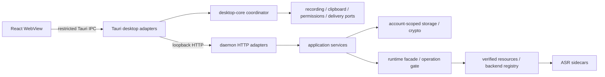

# Architecture

SeaSnail is a local macOS desktop application. The UI, desktop coordinator,
local daemon and ASR sidecars have separate responsibilities.

## Source map

| Location | Responsibility |
| --- | --- |
| `apps/desktop/src` | React views, queries, localization and user intent |
| `apps/desktop/src-tauri/src/lib.rs` | Desktop composition, command/event registration and window wiring |
| `apps/desktop/src-tauri/src/platform` | Recording, clipboard, permissions, text delivery and daemon adapters |
| `crates/desktop-core` | Portable realtime coordinator, task state, cancellation and capability ports |
| `crates/daemon/src/api` | Axum transport, request parsing, caller/scope checks and HTTP error mapping |
| `crates/daemon/src/application` | Account, token, session, transcription, model, learning and export use cases |
| `crates/storage`, `crates/crypto` | SQLCipher, encrypted files, key derivation and credential-store integration |
| `crates/runtime` | Canonical transcription interface, resource verification, runtime reservations and backend adapters |
| `crates/proto`, `proto` | Protobuf artifacts and the public OpenAPI contract |
| `apps/desktop/native/post-paste-monitor` | Native post-paste observation helper |

Paths in this table are relative to the repository root.

## Dependency boundaries

The portable desktop core depends on capability traits rather than Tauri,
macOS APIs, HTTP DTOs or runtime implementations. Native adapters implement
those traits. Shortcut and tray actions enter the same coordinator; React
consumes snapshots instead of owning a second submission or polling pipeline.

Daemon HTTP adapters call application services. Services use stable commands,
results and ports; transport parsing and backend-specific response DTOs stay
outside that boundary. Authenticated work binds an account-scoped data lease
rather than reopening whichever account happens to be active later.

Runtime callers receive canonical transcripts. Artifact resolution and
verification precede backend construction. A single typed operation gate
serializes transcription and model switching, with reservations releasing their
ownership on completion or cancellation.

Run `bash scripts/check-architecture-boundaries.sh` to check these boundaries.
The script checks concrete dependency and ownership rules, not every possible
architectural property.

## Recording and delivery

1. A shortcut or tray action enters the realtime coordinator.
2. The recording adapter checks permission and starts audio capture.
3. Stopping recording submits audio and collected context to the local daemon.
4. The daemon persists the session, normalizes audio and runs the active ASR
   backend. Optional cleanup produces the final text with original-text fallback
   on failure.
5. The coordinator receives task state, refreshes session views and asks the
   native delivery adapter to copy or paste the result. Generation checks reject
   late results from cancelled tasks.

Native permission dialogs, global shortcuts and automatic paste require a real
macOS session; UI-only development does not exercise them.

## Clipboard context

When enabled, collection is active only during recording. The collector starts
from the current pasteboard change counter; existing clipboard content is not
captured merely by starting a recording. New supported clipboard changes become
ordered events anchored to the captured audio frame offset.

Text, rich text, file references and copied images have different payloads.
Image copies use a local media cache. Audio and the context manifest are
submitted together, and the daemon encrypts persistent session context.
Transcription composition uses validated timestamps where available and falls
back to segment boundaries. Retry reuses the saved context.

The desktop owns safe thumbnail display, opening cached media and native rich
text delivery. Private image-cache files can be plaintext; account encryption
must not be described as encrypting every temporary cache. See
[privacy](privacy.md), [中文隐私说明](privacy.zh-CN.md) and the
[context illustration](assets/clipboard-context.svg).

## Accounts and storage

The global account registry contains metadata needed before unlocking an
account, not plaintext passwords or data-encryption keys. Each account has its
own encrypted database and session files. Wrapped DEKs store the KDF parameters
needed to unlock existing data; changing defaults must not invalidate old files.

Bearer verification identifies the account and applies scope checks before
account-scoped repository access. Credential-store adapters are injected:
unit tests use memory stores, while native credential behavior requires the
appropriate macOS app context. Development file-credential fallback is described
in [release requirements](releasing.md).

Logout clears in-memory decryption material and automatic-login credentials
while retaining encrypted account data. The desktop-only authentication
capability is separate from the public bearer API and is not exposed to the
WebView. See [account lifecycle](account-login-lifecycle.md).

## Contracts and validation

Public integration types come from [OpenAPI](../proto/openapi.yaml). Session
artifacts use [protobuf](../proto/seasnail/v1/transcript.proto). Generated API
types should be regenerated from the contract rather than edited by hand.

API regression runs a separate host using the production daemon composition,
with isolated test homes and fixture credentials. Its
[coverage matrix](../tests/api_regression/docs/design.md) preserves stable case
IDs and required/quick membership. Quick regression, full acceptance and real
macOS UI/credential validation provide different evidence; one does not replace
the others.
