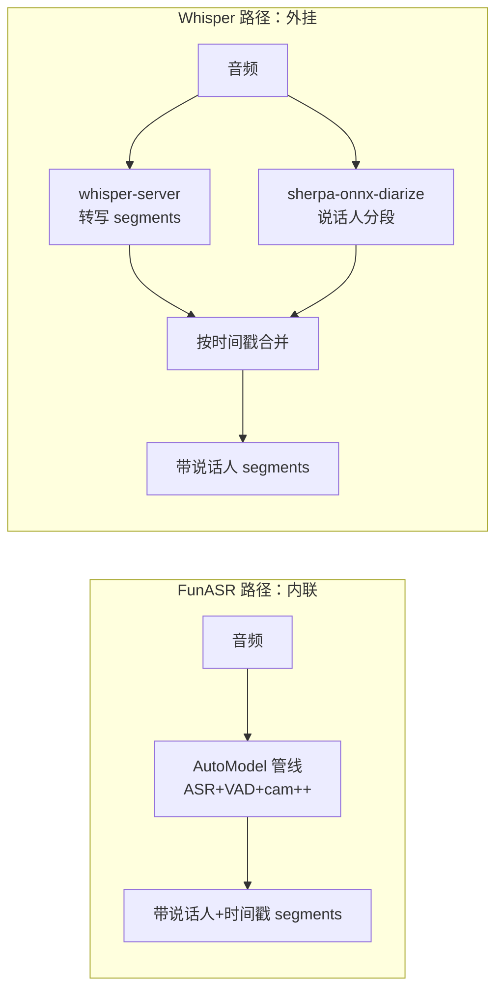
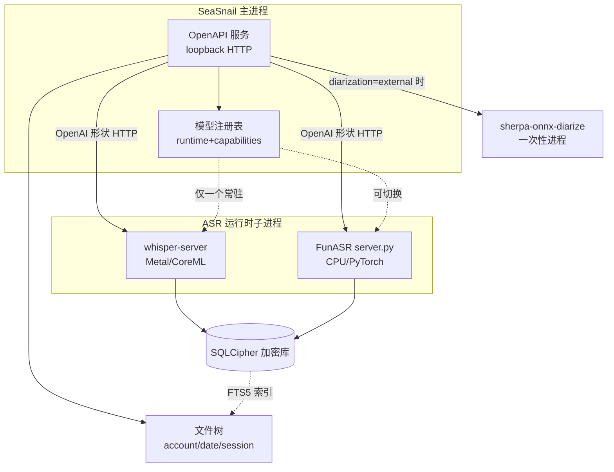

# ASR 架构调研

> 本文是早期 ASR 选型调研，不代表当前 SeaSnail 的生产默认架构。当前默认实现已切换为 Sherpa ONNX SenseVoice int8 native sidecar；FunASR 和 Whisper 仅作为兼容候选 driver 保留，Whisper/FunASR 双后端与自动路由内容属于历史方案或后置方向。

> 本文记录对 FunASR、Whisper 运行时、openwhispr（参考实现）的源码级调研，结论用于 SeaSnail 的「屏蔽模型差异 / 运行时独立进程」架构设计。分调研结论速览、FunASR、Whisper 运行时、说话人分离、openwhispr 实现、SeaSnail 设计建议、置信度与来源七部分。

## 调研结论速览

| 调研对象 | 关键结论 |
|---|---|
| FunASR | Python + PyTorch；自带 OpenAI 兼容 HTTP server；diarization 由 `cam++` 模型在管线内联完成（无需第二进程）；`paraformer-zh` 适配中英混杂 |
| Whisper 运行时 | M 芯片上 `whisper.cpp`（Metal + CoreML）显著快于 `faster-whisper`（CPU）与 `openai/whisper`（CPU）；`whisper.cpp` 自带 `whisper-server` HTTP 守护进程 |
| 说话人分离 | Whisper 无内置 diarization，需第二进程；`pyannote.audio`（Python）或 `sherpa-onnx`（原生二进制，openwhispr 采用） |
| openwhispr | STT 运行时 = 独立 loopback HTTP 子进程；diarization = 独立 `sherpa-onnx-diarize` 进程；SQLite 明文不加密、音频存文件系统；token 无 scope 分级；Custom ASR shim = OpenAI 形状契约 |

> 承重结论（均经源码核实）：① openwhispr 的 STT 是 loopback HTTP 守护进程（子二进制），非进程内库；② diarization 是独立 `sherpa-onnx-diarize` 进程；③ SQLite 明文且音频在文件系统；④ Custom ASR shim 契约 = OpenAI 形状 `POST /v1/audio/transcriptions` → `{"text":...}`；⑤ FunASR 的 OpenAI-API server 已满足同一契约，并内联 `cam++` diarization——使其成为 SeaSnail 第二后端的最小适配量选择。

## FunASR

| 维度 | 结论 |
|---|---|
| 运行时 / 语言 | Python + PyTorch。先装 PyTorch + torchaudio，再 `pip install funasr`。核心 API 为 `funasr.AutoModel`，"协调 ASR、VAD、说话人模型并返回合并结果"。 |
| 独立进程 / server | 两条路径。(a) `examples/openai_api/server.py`——FastAPI/uvicorn，OpenAI `/v1/audio/transcriptions` 的 drop-in 替换，`python server.py --model sensevoice --port 8000`，冷启动约 20s。(b) `runtime/` C++ SDK——websocket 服务（离线 + 在线），以 Docker 镜像分发。二者均可作为子进程拉起。 |
| diarization | 内联。`cam++` 说话人模型（7.2M 参数），以 `spk_model="cam++"` 纳入 `AutoModel`；管线一次返回说话人 ID + 时间戳 + 文本。README 注明 diarization 由独立的 CAM++ 模型提供、不在 ASR checkpoint 内——但仍在同一进程管线内，无需第二运行时。 |
| 中文 / 中英混杂 | `paraformer-zh`（220M，zh/en）为离线中英混杂首选；`SenseVoiceSmall`（234M，zh/en/ja/ko/yue）附带情绪 + 音频事件。两者均明确支持 zh+en。 |
| 离线 vs 流式 | 离线：`paraformer-zh`、`SenseVoiceSmall` 等。流式：`paraformer-zh-streaming`（websocket，~600ms chunk）+ `2pass`（在线低延迟 + 句末离线纠错）。 |
| 模型来源 / 体积 | ModelScope（主）与 HuggingFace。体积：`paraformer-zh` 220M、`SenseVoiceSmall` 234M、`cam++` 7.2M、`fsmn-vad` 0.4M、`ct-punc` 290M、`Fun-ASR-Nano` 800M、`Qwen3-ASR` 1.7B。 |

> 对 SeaSnail 的意义：FunASR 的 `examples/openai_api/server.py` 已说 OpenAI 形状 `/v1/audio/transcriptions`，并把 VAD + 标点 + `cam++` diarization 打包进一条管线——可作为与 whisper.cpp 同形 HTTP 契约的后端进程，几乎零协议胶水。

## Whisper 运行时（Apple Silicon）

| 运行时 | 后端 | M 芯片加速 | 自带 server | diarization |
|---|---|---|---|---|
| `openai/whisper` | PyTorch | README 未提 MPS/Metal，Mac 上实质 CPU | 无 | 无 |
| `faster-whisper`（SYSTRAN） | CTranslate2 | Mac 上 CPU-only（README 仅文档 CUDA） | 无（库，需自包） | 无 |
| `whisper.cpp`（ggerganov） | C++ | Metal（GPU）+ CoreML（ANE）+ Accelerate（CPU BLAS），CoreML 编码器在 ANE 上 >3x CPU | 有，`whisper-server`，OAI 形状 HTTP | 无 |

M 芯片性能排序（README 支撑）：`whisper.cpp`（Metal+CoreML）> `faster-whisper`（CPU int8）> `openai/whisper`（CPU）。`faster-whisper` 仍号称较 `openai/whisper` 快约 4x 且更省内存。**SeaSnail MVP 在 Apple Silicon 上应选 `whisper.cpp`**——唯一原生 Metal/CoreML，且自带 openwhispr 所包裹的 HTTP 守护进程。

模型体积：`openai/whisper` 表 tiny 39M / base 74M / small 244M / medium 769M / large 1550M / turbo 809M；`whisper.cpp` GGML 磁盘体积（openwhispr registry）tiny ~75MB / base ~142MB / small ~466MB / medium ~1.5GB / large ~3GB / turbo ~1.6GB。

语言：`openai/whisper` 支持 `detect_language()` 与 30s 滑窗转写，但 README 不涉及中英混杂——该场景应路由到 FunASR `paraformer-zh`。

## 说话人分离现状

Whisper 自身无 speaker diarization。标准补法：

1. `pyannote.audio`——Python/PyTorch diarization 工具，预训练 `speaker-diarization-community-1` 管线（需 HuggingFace token + 条款接受）。这是**第二个独立 Python 进程**，两遍（先 diarize 再把 Whisper segments 归到说话人）。
2. `sherpa-onnx`——原生二进制，内含 ONNX 版 pyannote segmentation 3.0 + 3D-Speaker/CAMP++ 嵌入 + Silero VAD。**openwhispr 实际采用此方案**，避免引入 Python 栈。



> 结论：为 Whisper 后端加 diarization = 引入第二运行时/进程（pyannote.audio 或 sherpa-onnx）；FunASR 则内联，无需。这是两后端的关键能力差异，SeaSnail 的模型抽象须显式表达。

## openwhispr 源码级实现

### 模型抽象
单一事实源 `src/models/modelRegistryData.json`，含 `cloudProviders` + `localProviders` 数组，每个模型带 `runtime: offline|online` 字段；由 `ModelRegistry.ts` 包装、`aiProvidersConfig.ts` 派生可用模式。本地 STT 后端各自带 helper：whisper.cpp（GGML，`whisper.js` → `whisperServer.js`）、NVIDIA Parakeet（sherpa-onnx）。

### Custom ASR shim 契约
位于 `examples/custom-asr-shim/`（`shim_template.py` 等）。这是自托管/非 OpenAI 后端须实现的契约：
- 传输：stdlib HTTP server 绑定 `127.0.0.1:8765`；loopback/私网允许 `http://`，公网须 HTTPS。
- 请求：`POST /audio/transcriptions`，`multipart/form-data`，字段 `file`（必需）+ `model`/`language`/`prompt`（可选）。此路径**不发 Authorization 头**——厂商密钥存于 shim env。
- 响应：`200 {"text": "...", "object": "transcription"}`，纯批量，非 SSE。
- 实现面：单个 Python 函数 `transcribe(audio_path, model, language, prompt) -> str`。shim 负责 ffmpeg 转 16kHz 单声道 WAV、multipart 解析、OpenAI 形状 JSON 响应。

> 该契约即 OpenAI 兼容 `/v1/audio/transcriptions` 适配器——与 FunASR `server.py` 已暴露的形状一致。

### 进程与 IPC
模型运行时为**独立进程**，非进程内库。三种 IPC 形态并存：

1. **whisper.cpp = 常驻 loopback HTTP 守护进程。** `whisperServer.js` 以 Node `spawn`（Unix `detached:true`）拉起 `whisper-server-${platform}-${arch}`；暴露 `GET /`（健康，启动期每 100ms 轮询，运行期 5000ms）与 `POST /inference`（multipart `audio.wav`，16kHz 单声道经 FFmpeg，附 `language`/`prompt`/`response_format`）。端口在 8178–8199 扫首个空闲。启动预热、睡眠唤醒后再预热（"sleep 会把模型从 VRAM 驱逐"）。主↔运行时 IPC = loopback HTTP，音频以二进制 buffer 发送。
2. **diarization = 独立 `sherpa-onnx-diarize` 子进程。** `diarization.js` 按作业 spawn，以 `Set` 跟踪（会议后处理与上传/批量可重叠）。模型：pyannote segmentation 3.0（ONNX）+ 3D-Speaker CAMP++ 嵌入 + Silero VAD；聚类在 sherpa-onnx 二进制内（`--clustering.num-clusters`/`cluster-threshold` 默认 0.55）。输出 stdout 行 `start -- end speaker_N`，正则解析。
3. **ONNX embeddings = Electron `utilityProcess`**（懒启动，隔离原生崩溃，`bad_alloc` 限于 worker，退避重启）。
4. 主↔渲染 IPC = Electron `ipcMain`/`ipcRenderer` 经 preload 桥 + context isolation。

### 存储与密钥
- DB：`better-sqlite3`，文件在 `app.getPath("userData")`，`journal_mode=WAL`。**落盘不加密**——无 `PRAGMA key`、无 SQLCipher；SQLite 文件明文。
- 音频 blob 不入库：`transcriptions` 表仅 `has_audio` 标志 + `audio_duration_ms`，无 blob 列；`clearAudioFlags()` 置标志、`deleteTranscriptionsExpiredBefore()` 返回 id 以供调用方删文件——音频在文件系统（`audioStorage.js`）。
- 表：`transcriptions`、`notes`、`notes_fts`（FTS5 搜索虚表）、`folders`、`speaker_profiles`（`embedding BLOB`）、`google_calendar_tokens`（token 为**明文 TEXT**）等。
- 密钥 vs 数据：BYOK API 密钥经 Electron `safeStorage` → OS keychain 加密（macOS Keychain / Windows DPAPI / Linux libsecret），存为 `userData/secure-keys/` 下逐键文件；Linux 无 keyring 退化为明文。**但转录、笔记乃至 SQLite 中的 Google OAuth token 均明文**——这是 SeaSnail 不应复制的缺口。

### token 与 bootstrap
- CLI 桥（`cliBridge.js`）：loopback HTTP server 于 `127.0.0.1`，端口 8200–8219，bearer-token 鉴权。
- token 生成：每次 `CliBridge.start()` 用 `crypto.randomBytes(32).toString("hex")`（64 字符）新签，持久化 `{version,port,token}` 到 `~/.openwhispr/cli-bridge.json`（mode `0o600`），CLI 读该文件发现端口+token。
- 校验：loopback 强制（remote address 须在 `{127.0.0.1, ::1, ::ffff:127.0.0.1}` 否则 403）；`Authorization: Bearer <token>` 先长度预检再 `crypto.timingSafeEqual`。
- **scope：无。** 鉴权是二元的——单一共享 token 授予全部路由。这是 SeaSnail 可改进处（scoped token）。

## 对 SeaSnail 的设计建议

### 统一运行时接口
每个后端设计为**独立进程暴露统一本地契约**，两层：

```typescript
// 层 A：进程生命周期（host 侧）
interface ModelRuntime {
  name: string;                       // "whisper.cpp" | "funasr" | ...
  capabilities: Capabilities;
  start(cfg: RuntimeConfig): Promise<void>;   // spawn 子进程、加载模型、等健康
  stop(): Promise<void>;
  health(): Promise<HealthStatus>;            // {state, model, gpu?, rssMb, uptimeMs}
  reload(modelId: string): Promise<void>;      // 若支持则热切换模型
}
interface Capabilities {
  diarization: "builtin" | "external" | "none";
  streaming: boolean;
  languages: string[];
  maxAudioSeconds: number;
}
```

```text
# 层 B：转写契约（runtime 侧，经 IPC）——采用 openwhispr 已验证的 OpenAI 形状
POST /v1/audio/transcriptions   (multipart file + 可选 model/language/prompt)
-> 200 {"text": "...", "object": "transcription"}
# 可选 POST /v1/audio/diarizations -> {segments:[{start,end,speaker}]}
```

这是让 `whisper.cpp` 的 `whisper-server` 与 FunASR 的 `server.py` 都已满足的最小契约——MVP 几乎不写适配胶水。

### diarization：能力声明 + 可插拔（混合方案）
建议**两者并存**——能力标志 + 可插拔 diarizer：
- `capabilities.diarization = "builtin"`（FunASR）：`cam++` 内联，一次返回带说话人 segments，无额外进程。
- `capabilities.diarization = "external"`（whisper.cpp）：委托独立 `Diarizer` 运行时，后端为 **sherpa-onnx-diarize**（pyannote-seg-3.0 ONNX + CAMP++ + Silero），同 openwhispr；避免为 diarization 拖入 Python/PyTorch 栈。
- `capabilities.diarization = "none"`：云端/无此后端。

理由：FunASR 内联 diarization 是真实差异点，强行走外挂会浪费它；Whisper 确实缺失、需第二进程，openwhispr 的 sherpa-onnx 选型是正确先例。

### IPC 选型

| 选项 | 优点 | 缺点 | MVP 取舍 |
|---|---|---|---|
| Loopback HTTP（OpenAI 形状） | whisper.cpp 与 FunASR 已说；零协议代码；curl 可调试；同 openwhispr | 需端口分配（扫范围） | **主选** |
| Unix domain socket | 无端口冲突、FS 权限安全 | whisper-server 为 TCP，需前置包装 | 后置 |
| stdin/stdout | 最简、无端口 | 不适合常驻已加载模型（每次重载毁延迟，FunASR ~20s） | 仅用于一次性 diarize 作业 |
| gRPC | 强类型、双向流 | protobuf/grpc 依赖臃肿，无 Apple 原生收益 | **不取** |

> 建议：loopback HTTP + OpenAI 形状契约为主，stdin/stdout 仅用于一次性 diarize 二进制，MVP 跳过 gRPC 与 UDS——即 openwhispr 已生产验证的模式。

### 两套运行时共存的坑（whisper.cpp C++/Metal + FunASR Python/PyTorch，单台 M 芯片）
- 内存压力：两者常驻模型，Whisper large ~3GB + paraformer ~1.5–2GB + 运行时 + OS，易 6–8GB。**缓解**：一次仅一个"活跃"重模型；空闲超时 `unload()`、按需 reload（接受切换代价）；照搬 openwhispr 预热 + 唤醒再预热。
- Metal 争用：whisper.cpp 用 Metal/CoreML；FunASR 在 Mac 上跑 CPU（PyTorch MPS 非 FunASR 良路且未文档化）。FunASR CPU-only，勿同时跑两个 Metal 消费者。
- 模型切换代价：FunASR ~20s 冷加载、Whisper large 数秒。懒卸载 + keep-alive 窗口，绝不按转写 spawn。
- 双语言工具链打包：C++/Metal（whisper.cpp 预编译 `whisper-server-darwin-arm64`）vs Python/PyTorch + funasr 依赖。FunASR 可冻成二进制（PyInstaller）或内置 hermetic Python venv；OpenAI-API server 使语言边界对 host 不可见。
- 崩溃隔离：一运行时的原生崩溃不得杀整个 App。用 openwhispr `utilityProcess`/退避重启 + 带 `will-quit` 清理的 `sidecarRegistry`。
- 切换生命周期：换后端 = 停一个、起一个（不同时保活）。端口范围扫描 + 健康轮询是正确模板。

### 可复用 vs 必须不同

**可直接复用（openwhispr）：**
- STT loopback HTTP 守护进程模式：spawn `whisper-server-darwin-arm64`、扫端口、健康轮询 `GET /`、`POST /inference` multipart audio.wav（16kHz 单声道经 FFmpeg）、预热 + 唤醒再预热。
- OpenAI 形状 custom-shim 契约（`{"text":...,"object":"transcription"}`、loopback 允许 http、单一 `transcribe()` 函数）——亦即 FunASR server 形状，一契约覆盖两 MVP 后端。
- 独立 `sherpa-onnx-diarize` 子进程模式（pyannote-seg-3.0 + CAMP++ + Silero、stdout 行解析、与转写合并）。
- CLI 桥 loopback HTTP + bearer token（`crypto.randomBytes(32)`、`timingSafeEqual` 带长度预检、`~/.<app>/cli-bridge.json` mode 0o600、127.0.0.1-only）。
- sidecar 注册 + `will-quit` 清理；ONNX `utilityProcess` 崩溃隔离；模型注册表 JSON 作单一事实源带 `runtime` 字段。
- Electron context isolation + preload 桥；DB 加密密钥经 `safeStorage` 存 OS keychain。

**SeaSnail 必须不同：**
- **落盘加密。** openwhispr SQLite 明文（含 Google OAuth token）。SeaSnail 须加密 → **SQLCipher**（`PRAGMA key='<derived>'`）或对 transcript/audio blob 做应用层 AEAD；DB 密钥存 OS keychain，绝不硬编码。这是最大安全增量，也是需求文档方案 B 的落地。
- **FunASR 后端。** openwhispr 无 FunASR。须加 FunASR 运行时适配器——但 `server.py` 已说 OpenAI 形状，适配器多为生命周期/健康胶水，加 `capabilities.diarization="builtin"` 路径内联返回带说话人 segments。
- **文件树存储。** openwhispr 转录+元数据入 SQLite、音频在盘。SeaSnail 要文件树：每次录音存为文件三联（音频 + 转录 JSON + 元数据 sidecar）于按日期分目录树；SQLite 仅作 FTS5 搜索索引（或 MVP 跳过）。复用 openwhispr"音频不入库"洞察，并扩展为"转录文本也是文件，DB 仅索引"。
- **scoped token。** openwhispr 单一共享 token 授全部。SeaSnail 在同 loopback bearer 基建上加 scope（`sessions:read/write/delete`、`tokens:manage`），成本低（见 `proto/openapi.yaml`）。
- **后端选择策略（可选）。** 因两后端互补（whisper.cpp：英文/多语 + Metal 速度；FunASR paraformer-zh：中英混杂 + 内联 diarization），可加路由：中英混杂/中文 → FunASR，英文/多语 → whisper.cpp。注意：需求文档要求 MVP 为**用户手动切换**模型，自动路由为后置增强，不应纳入 MVP。



## 置信度与未确认项
- FunASR paraformer/SenseVoice 精确常驻内存（RSS）公开文档未给；~1.5–2GB 为按 220M/234M fp32 + PyTorch 开销估算，待 M 芯片实测。
- `faster-whisper` Apple Silicon GPU 情况 README 仅文档 CUDA，CTranslate2 无公开 Metal 后端，CPU-only 为安全假设，确证需查 CTranslate2 device 后端。
- `openai/whisper` Mac 上 MPS 性能 README 未提；社区报告不一、MPS 对 Whisper 普遍不快于 CPU，按 CPU 处理。
- `pyannote.audio` 许可证 README 未明示；模型需 HuggingFace token + 条款接受，这是对 SeaSnail 的实际约束（故推荐 sherpa-onnx 路径）。

## 来源
- FunASR README — https://raw.githubusercontent.com/modelscope/FunASR/main/README.md
- FunASR OpenAI-API 示例 — https://raw.githubusercontent.com/modelscope/FunASR/main/examples/openai_api/README.md
- FunASR runtime 概览 — https://raw.githubusercontent.com/modelscope/FunASR/main/runtime/readme.md
- openai/whisper README — https://raw.githubusercontent.com/openai/whisper/main/README.md
- SYSTRAN/faster-whisper README — https://raw.githubusercontent.com/SYSTRAN/faster-whisper/master/README.md
- whisper.cpp README — https://raw.githubusercontent.com/ggerganov/whisper.cpp/master/README.md
- pyannote.audio README — https://raw.githubusercontent.com/pyannote/pyannote-audio/develop/README.md
- openwhispr CLAUDE.md — https://raw.githubusercontent.com/OpenWhispr/openwhispr/main/CLAUDE.md
- openwhispr SECURITY.md — https://raw.githubusercontent.com/OpenWhispr/openwhispr/main/SECURITY.md
- openwhispr src/helpers — https://github.com/OpenWhispr/openwhispr/tree/main/src/helpers
- openwhispr custom-asr-shim — https://github.com/OpenWhispr/openwhispr/tree/main/examples/custom-asr-shim
- openwhispr shim_template.py — https://raw.githubusercontent.com/OpenWhispr/openwhispr/main/examples/custom-asr-shim/shim_template.py
- openwhispr src/helpers/whisper.js — https://raw.githubusercontent.com/OpenWhispr/openwhispr/main/src/helpers/whisper.js
- openwhispr src/helpers/whisperServer.js — https://raw.githubusercontent.com/OpenWhispr/openwhispr/main/src/helpers/whisperServer.js
- openwhispr src/helpers/diarization.js — https://raw.githubusercontent.com/OpenWhispr/openwhispr/main/src/helpers/diarization.js
- openwhispr src/helpers/database.js — https://raw.githubusercontent.com/OpenWhispr/openwhispr/main/src/helpers/database.js
- openwhispr src/helpers/cliBridge.js — https://raw.githubusercontent.com/OpenWhispr/openwhispr/main/src/helpers/cliBridge.js
