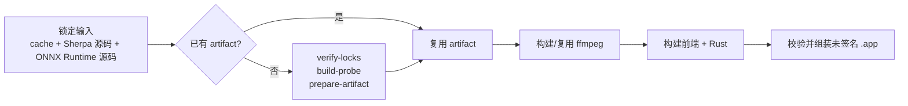

# SeaSnail 中文开发指南

[English](development.md) · [项目介绍](../README.zh-CN.md)

SeaSnail 是一个优先面向 macOS Apple Silicon 的本地语音转文字桌面应用。它在本机录制音频、调用随应用交付的 Sherpa ONNX SenseVoice 运行时转写，并支持会话管理、账户隔离、集成令牌、加密导出和将结果粘贴到当前焦点应用。

项目目前处于 MVP 开发阶段：核心转写链路、Tauri 桌面壳和 React 工作台已落地；发行签名/公证及 macOS TCC 的人工上机验收仍是交付前门禁。

开发者与 Agent 开始修改前，请先阅读本文的[测试与 Agent 开发约定](#测试与-agent-开发约定)。API 回归的执行和维护方式见[测试说明](../tests/api_regression/README.md)。

## 项目介绍

SeaSnail 的原则是把敏感能力留在原生层：WebView 不持有 root bearer、原始录音或明文导出 ZIP。桌面端通过受限 Tauri IPC 调用原生层；原生层持有 Keychain 中的凭据，并代理访问本机 daemon；daemon 负责账户、加密存储、会话 API 和转写任务编排。

```text
React WebView
  → 受限 Tauri IPC
  → Tauri 原生层（录音、快捷键、Keychain、文本注入）
  → 本地 daemon（OpenAPI、账户、加密、存储、任务编排）
  → Sherpa ONNX sidecar（本机转写）
```

账户设置提供“退出登录”，退出后可登录已有账户或新建账户；退出保留本地数据，并停止自动登录。具体行为与桌面权限边界见[账户登录与退出](account-login-lifecycle.md)。

默认快捷键为 `Command+Shift+Space`，可在设置页调整。转写状态由原生任务事件驱动刷新会话历史，完成后会经原生层尝试注入到当前焦点应用；辅助功能未授权时会降级为复制文本。

## 快速开始

以下命令均从仓库根目录执行。首次构建请先准备下方工具和锁定的 Sherpa 输入，再按 [macOS 本地构建教程](build_for_MacOS_tutorial.md) 操作。教程区分“复用已验证制品”和“从锁定源码构建”两条路径。

### 运行已有开发包

如果已有本地构建的 App，打开实际输出路径。例如使用默认输出时：

```bash
open dist/SeaSnail.app
```

如果收到内部测试 DMG，可打开后将其中的 App 拖入 Applications，再启动安装后的应用。具体文件名由构建或分发者提供；本文不绑定某个需求批次的产物。

当前本地构建入口生成未签名开发版。首次录音或文本注入时，请在 macOS 系统设置中允许麦克风和辅助功能权限。若 Gatekeeper 阻止未签名应用，请仅在确认构建来源可信的前提下手动放行。

### 从源码准备

当前开发构建仅支持 **macOS 13+、Apple Silicon（arm64）**。建议先安装：

- Xcode Command Line Tools
- Rust stable toolchain（含 `cargo`；rustup 默认安装在 `~/.cargo/bin`）
- Node.js：使用 22.22.2+ 的 22.x、24.15+ 的 24.x 或 26+，满足当前锁文件中 Vite、Vitest 和 jsdom 的共同要求；pnpm 9+
- `jq`、Python 3.11+（打包许可证收集使用内置 TOML 解析器）；从源码构建 Sherpa 还需要 CMake 和 Apple C++ 工具链
- 网络访问能力（首次准备锁定的 Sherpa 源码依赖和模型时需要）

若终端提示 `cargo: command not found`，先在当前终端加载 rustup 环境：

```bash
source "$HOME/.cargo/env"
cargo --version
```

若 `~/.cargo/env` 不存在，则尚未安装 Rust；请按 [rustup.rs](https://rustup.rs/) 安装 Rust stable toolchain 后重新打开终端。

先运行只读环境检查，再安装前端依赖并生成/校验 OpenAPI 类型：

```bash
python3 scripts/doctor.py --frontend-only
pnpm --dir apps/desktop install --frozen-lockfile
pnpm --dir apps/desktop generate:openapi
pnpm --dir apps/desktop typecheck
pnpm --dir apps/desktop build
```

验证 Rust 工作区：

```bash
cargo test --workspace
```

> `apps/desktop/src/api/openapi.ts` 从 `proto/openapi.yaml` 生成。修改 OpenAPI 契约后必须重新执行 `generate:openapi`，不要手动编辑生成文件。

### 本地开发工作流

SeaSnail 没有根目录 `package.json`；本文通过 `pnpm --dir apps/desktop` 执行前端命令，Rust 命令在仓库根目录执行。API 测试使用独立的 `tests/api_regression` 项目。

只开发 React 工作台时，可以启动 Vite 开发服务器：

```bash
pnpm --dir apps/desktop dev
```

该模式适合调整页面、组件和样式，但不提供 Tauri 原生 IPC、全局快捷键、录音、状态栏和悬浮胶囊能力。涉及这些能力时，应使用下面的开发 App 流程进行验证。

完成修改后，按[测试与 Agent 开发约定](#测试与-agent-开发约定)选择检查。需要验证录音、快捷键、IPC 等完整桌面行为时，使用下方[推荐出包流程](#推荐出包流程)重新构建开发 App。

多个开发 App 并行测试时，应分别设置 `SEASNAIL_DATA_DIR`，隔离数据和日志，避免共用同一数据目录录音。macOS 麦克风、辅助功能等权限仍由系统管理。

前端、daemon、原生层、实时任务和剪贴板上下文的职责边界见[架构说明](architecture.md)。系统权限与缓存边界见[隐私说明](privacy.zh-CN.md)。

## 本地构建

### 推荐出包流程

统一入口为 [scripts/build.sh](../scripts/build.sh)，默认使用 **Sherpa ONNX SenseVoice int8**。推荐 `--package`：复用已有 artifact，缺失时从事先准备的锁定 cache 和源码 checkout 构建，再准备 FFmpeg、构建前端和 Rust、组装 App。源码与缓存的准备见[构建教程](build_for_MacOS_tutorial.md)。

已有 artifact 必须与当前模型 catalog 匹配；脚本不会自动替换不匹配的旧制品。中间产物默认保存在 `third_party/` 下：



锁定输入已准备好，或已有匹配 artifact 时：

```bash
scripts/build.sh --package --output dist/SeaSnail.app &&
open dist/SeaSnail.app
```

如果只想准备运行时：

```bash
scripts/build.sh --prepare-runtime
```

维护者需要显式指定输入时，可使用 `--sherpa-cache`、`--sherpa-source`、`--onnxruntime-source` 和 `--runtime-build-root`。`--app` 和 `--all` 仍保留用于已有 artifact 的显式构建；`--all` 不会自动准备 Sherpa。

### 目录结构

```text
.
├── apps/desktop/              Tauri 桌面客户端
│   ├── src/                   React/Vite 前端（features、IPC API、shadcn/ui）
│   └── src-tauri/             原生层（快捷键、录音、权限、Keychain、daemon 监管）
├── crates/
│   ├── daemon/                本地 Axum/OpenAPI 服务与业务编排
│   ├── runtime/               ASR driver、runtime facade、资源校验、并发门禁和音频归一化
│   ├── storage/               SQLite 与加密文件存储
│   ├── crypto/                Keychain、KDF、HKDF、AEAD
│   ├── desktop-core/          平台无关实时任务协调器与能力接口
│   └── proto/                 protobuf 生成与共享协议类型
├── proto/                     OpenAPI 与 protobuf 源契约
├── scripts/
│   ├── macos/                 macOS 开发 App 打包脚本
│   ├── funasr/                兼容用 FunASR 运行包、依赖和模型准备脚本
│   ├── sherpa/                Sherpa ONNX 源码/模型锁、artifact 准备和 sidecar 构建脚本
│   └── ffmpeg/                内置 arm64 ffmpeg 的可复现构建脚本
├── third_party/sherpa/        本地 Sherpa artifact（不入普通 Git）
├── third_party/ffmpeg/        ffmpeg 源码缓存和 bundle（不入普通 Git）
├── packaging/macos/           App 元数据与打包资源
├── tests/api_regression/       Playwright API 回归、测试宿主、版本化资产与报告
└── doc/                       架构、开发、安装、隐私与发布说明
```

### 软件框架与依赖

| 层级 | 主要技术 |
| --- | --- |
| 桌面 UI | Tauri 2、React 19、Vite、TypeScript、Tailwind CSS、shadcn/ui、TanStack Query |
| 原生能力 | Rust、cpal、arboard、Core Graphics、macOS AVFoundation / Accessibility |
| 本地服务 | Rust、Tokio、Axum、OpenAPI |
| 数据与安全 | SQLite/SQLCipher、Keychain、Argon2id、HKDF、ChaCha20-Poly1305 |
| 转写 | Sherpa ONNX SenseVoice int8 native sidecar；FunASR/Whisper 仅保留兼容 driver |
| 契约与测试 | OpenAPI、protobuf、openapi-typescript、Spectral、Vitest/MSW、Cargo tests、Playwright Test（API） |

### 第三方运行时依赖与仓库边界

仓库只管理**可复现构建所需的文本材料**：构建脚本、固定版本、下载地址、SHA-256、依赖锁和许可证清单。大型二进制制品不提交到普通 Git，也不会因为构建机已安装 Homebrew 而成为运行时依赖。

| 依赖 | Git 管理 | 本地/制品管理 | 说明 |
| --- | --- | --- | --- |
| `FFmpeg` | 构建脚本、GitHub tag、SHA-256、LGPL 文本与构建元数据 | 源码缓存、编译后的 arm64 二进制 | 由 `scripts/ffmpeg/build-macos-arm64.sh` 构建，随后复制进 `.app`；不使用 Homebrew 二进制或动态库。 |
| Sherpa ONNX、ONNX Runtime、SenseVoice int8、VAD | `scripts/sherpa/` 锁文件、离线构建/准备脚本、许可证清单 | 源码/依赖 cache、编译 native install、最终 artifact | 默认运行时；artifact manifest 与 catalog 哈希/尺寸必须一致，不进普通 Git。 |

因此，首次准备运行时需要网络；完成后，本地缓存和 bundle 可被后续构建复用。若团队需要“下载一次即可离线构建”，应分发带 SHA-256 的运行时制品，而不是把数 GB 文件写入 Git 历史。

### 准备 Sherpa ONNX 默认运行包

首次开发可使用新增的锁定输入获取入口，预览后再下载：

```sh
python3 scripts/doctor.py
python3 scripts/sherpa/fetch-inputs.py --list
python3 scripts/sherpa/fetch-inputs.py
scripts/build.sh --package --output dist/SeaSnail-dev.app
```

获取脚本根据当前 source/artifact lock 下载归档、模型和固定源码，初始化锁定子模块，并调用既有校验器。源码使用锁定 tag 的浅克隆并核对完整 commit；ONNX Runtime 省略未启用单元测试所需的大型 `onnxruntime/test/testdata`，构建源码和锁定子模块不变。每个 Git 步骤最多等待 5 分钟，重试会复用已校验归档。匹配输入可复用；已有输入不匹配或源码不干净时拒绝覆盖。此步骤需要联网和较大的磁盘空间。

**原生构建可复现性**：artifact manifest 对编译后的二进制也固定大小和哈希。构建脚本现会先检查经过验证的编译器、SDK 和 CMake 版本，再规范嵌入二进制的源码与构建路径。准确版本见 [Sherpa 构建输入说明](../scripts/sherpa/BUILD-INPUTS.md)。若仍出现大小或哈希不匹配，请保留失败并报告，不得改哈希或绕过校验。发布前还需按[发布清单](releasing.md)重新验证当前版本。

准备失败可能留下不完整 artifact 目录，这不代表校验通过；重试前请将失败目录移到其他位置，不得分发该目录。准备脚本仅在全部校验通过后发布 `artifact-manifest.json` 完成标记。


从源码构建 Sherpa artifact 需要已锁定且干净的源码 checkout、离线 cache 和 `build-probe-macos-arm64.sh` 生成的 native install。先按 [Sherpa 构建输入说明](../scripts/sherpa/BUILD-INPUTS.md) 准备 lock 文件中列出的源码、归档和依赖，然后离线校验：

```bash
scripts/sherpa/verify-locks.sh \
  --cache /path/to/verified/cache \
  --source /path/to/clean/sherpa-onnx \
  --onnxruntime-source /path/to/clean/onnxruntime
```

校验通过后，准备流程不会联网，也不会覆盖既有输出：

```bash
scripts/sherpa/build-probe-macos-arm64.sh \
  --source /path/to/clean/sherpa-onnx \
  --onnxruntime-source /path/to/clean/onnxruntime \
  --cache /path/to/verified/cache \
  --output third_party/sherpa/macos-arm64/build/probe

scripts/sherpa/prepare-macos-arm64.sh \
  --source /path/to/clean/sherpa-onnx \
  --onnxruntime-source /path/to/clean/onnxruntime \
  --cache /path/to/verified/cache \
  --native-install third_party/sherpa/macos-arm64/build/probe/install \
  --output /absolute/path/to/new-sherpa-artifact
```

输出目录必须不存在；既有 artifact 不会被覆盖。将新目录作为 `SEASNAIL_SHERPA_ARTIFACT_ROOT` 传给后续构建。锁定来源、离线 cache、依赖闭包和许可证要求见 [Sherpa 构建输入说明](../scripts/sherpa/BUILD-INPUTS.md)。

### 复用制品与分步构建

已有经过验证、与当前 catalog 匹配的 Sherpa artifact 时，可显式指定路径。`--app` 会重新构建前端、GUI 和 daemon，并要求已有 FFmpeg bundle：

```bash
# 替换为本机已验证的 artifact 目录（包含 artifact-manifest.json）
export SEASNAIL_SHERPA_ARTIFACT_ROOT=/absolute/path/to/verified-sherpa-artifact
scripts/build.sh --app \
  --asr-root "$SEASNAIL_SHERPA_ARTIFACT_ROOT" \
  --output dist/SeaSnail-dev.app
```

需要同时构建整个 Rust workspace 和准备 FFmpeg 时，使用 `--all`；它仍要求已有 Sherpa artifact。首次 FFmpeg 构建会下载锁定的源码归档并校验 SHA-256，之后复用缓存；App 运行时不依赖 Homebrew。

```bash
scripts/build.sh --all \
  --asr-root "$SEASNAIL_SHERPA_ARTIFACT_ROOT" \
  --output dist/SeaSnail-all.app
```

仅验证实时录音时，可用 `--app --omit-ffmpeg` 生成冒烟包；该包不支持文件导入。常用目标区别如下：

| 目标 | 作用 |
| --- | --- |
| `--package` | 准备/复用 Sherpa 与 FFmpeg，构建前端、Rust workspace 和 App |
| `--prepare-runtime` | 准备/复用 Sherpa artifact；缺失时需要锁定的本地输入 |
| `--app` | 复用 Sherpa 与 FFmpeg，构建前端、GUI/daemon 并组装 App |
| `--all` | 复用 Sherpa，准备 FFmpeg，构建前端、Rust workspace 和 App |
| `--frontend` / `--rust` / `--ffmpeg` | 分别构建前端、Rust workspace 或 FFmpeg |
| `--help` | 查看完整参数和兼容选项 |

`--output` 必须指向不存在的路径；重新构建时请使用新名称。App 组装会校验 artifact manifest、catalog、文件哈希/尺寸及许可证材料；出现不匹配时应更换匹配制品或按锁定流程重建，不能绕过校验。

FunASR / GGUF 仅保留为内部兼容验证路径。需要时查看 `scripts/build.sh --help`、[FunASR 本地说明](../third_party/funasr/macos-arm64/README.md)及 `scripts/funasr/`；默认 Sherpa 构建无需准备 Python 模型 bundle。

本构建入口生成未签名开发包，并写入 `SEASNAIL_DEV_FILE_KEYCHAIN` 标记以启用普通文件 Keychain fallback。该包只用于开发和内部测试；正式发行需要独立的签名、公证、staple 流程，并确保移除开发 fallback 标记。

### 内部测试分发（无需付费）

内部测试或向少量可信用户临时共享时，不必加入 Apple Developer Program，也不必制作 DMG。建议先将 `.app` 压缩后发送，避免聊天工具或文件系统破坏 App bundle：

```bash
ditto -c -k --sequesterRsrc --keepParent \
  dist/SeaSnail-dev.app \
  dist/SeaSnail-dev.zip
```

测试用户解压后，如果 macOS 因网络下载标记阻止打开，可在确认文件来源可信后执行：

```bash
xattr -dr com.apple.quarantine /absolute/path/to/SeaSnail-dev.app
open /absolute/path/to/SeaSnail-dev.app
```

也可以在 Finder 中右键 App，选择“打开”。首次运行仍需分别授予麦克风和辅助功能权限。该方式只适合内部测试：当前 App 是未签名开发包，带有 `SEASNAIL_DEV_FILE_KEYCHAIN` 开发标记，不具备正式发行的安全语义；面向普通用户公开分发时，必须改用 Developer ID 签名和 notarization 公证。

## 测试与 Agent 开发约定

本文保留详细开发与 Agent 执行约定；项目介绍见根 README。开始开发前阅读相关需求、设计和路线图；完成修改后，根据影响范围主动执行以下检查，修复失败后重新验证，再报告结果。README 提供执行规则；实际测试仍需 Agent 或开发者调用命令。

### 按修改范围选择验证

下列命令均从仓库根目录执行；修改跨多个范围时合并对应检查。

| 修改范围 | 完成开发后的验证 |
| --- | --- |
| 文档 | 检查链接、命令与当前实现是否一致，并运行 `git diff --check`；仅文档修改无需运行业务测试 |
| 桌面前端 | `pnpm --dir apps/desktop typecheck`、`pnpm --dir apps/desktop test`、`pnpm --dir apps/desktop build` |
| Rust 业务逻辑 | `cargo check --workspace`、`cargo test --workspace`；影响 API 行为时执行下方 API 回归 |
| OpenAPI / protobuf 协议 | 执行对应代码生成；OpenAPI 修改后运行 `pnpm --dir apps/desktop generate:openapi`、`pnpm --dir apps/desktop lint:openapi`，并验证受影响的前端、Rust 与 API 回归 |
| API 行为、业务用例或测试资产 | API 测试类型和契约检查、受影响的用例或 suite，再运行 `quick` |
| 测试执行器、隔离/回收、错误分类、报告/安全发布、replay 或真实 ASR 链路 | 在上述检查基础上执行相关基础设施自检和 `acceptance`；整体验收也使用 `acceptance` |

API 回归使用 Playwright Test 的纯 API 模式，通过独立 Rust 测试宿主调用业务 HTTP API，无需安装浏览器。默认登记 23 个用例，其中 17 个属于 quick、22 个属于完整必验；真实 provider 评测单独显式执行。每次尝试使用隔离环境，记录步骤、诊断证据与清理结果。首次使用需准备依赖和固定 Sherpa/FFmpeg 制品，详见[环境准备与执行说明](../tests/api_regression/README.md)。

```sh
# 首次准备依赖
pnpm --dir tests/api_regression install --frozen-lockfile

# API 相关修改完成后
pnpm --dir tests/api_regression typecheck
pnpm --dir tests/api_regression check:contracts
pnpm --dir tests/api_regression api-test run CLEAN-002
# 将上面的示例 ID 替换为受影响用例；也可使用 suite clean 等组合
pnpm --dir tests/api_regression api-test quick

# 整体验收或影响框架公共链路时
pnpm --dir tests/api_regression api-test acceptance
```

新增用例按[用例与资产维护指南](../tests/api_regression/examples/README.md)登记：独立扩展通过显式 `--extension` 执行；纳入默认或必验范围时，同步需求/设计、登记、必验快照和范围校验。断言应验证业务承诺，前置状态通过业务 API 建立，步骤通过 `scenario.step` 留下证据。

### 失败处理与交付报告

Agent 不应通过删掉断言、跳过用例、放宽质量门槛或隐藏失败来完成验证。环境、固定制品或权限不足时，保留诊断并报告阻塞原因；需要改变已批准规则、预算或需求范围时，暂停相关实施并等待用户确认。

交付时说明修改内容、实际执行的命令、通过/失败/未执行情况，以及剩余限制。API 回归还需记录 `run_id`、退出码、实际用例范围、flaky 和清理状态，并给出 `result.json` 或 HTML 报告路径。`quick` 通过只能说明快速回归通过；完整验收必须以当次全部必验实际通过为准。过滤、skip、缺结果、分片或重试后的 flaky 均不能作为完整验收通过的证据。基础设施自检也不能替代业务验收。

可直接向 Agent 下达：

> 先阅读根 README 的开发与测试约定及相关需求文档，完成本次修改，按影响范围主动运行测试并修复问题。最后报告实际测试命令、结果和 API 回归报告路径；需要改变已批准规则或遇到待确认问题时暂停并说明。

## 日志与问题定位

daemon 会将运行日志按小时滚动写入数据根下的 `logs/` 目录。日志默认保留 7 天，目录总量上限为 50 MiB，超出时优先清理最旧文件。默认数据根为：

```text
~/Library/Application Support/SeaSnail/
├── logs/                 # daemon 与转写 sidecar 日志
├── bootstrap.json        # 仅包含本地服务端口与版本；正常退出时清理
├── daemon.lock           # daemon 单实例锁
└── data/                 # 账户加密数据；不要手动修改
```

因此默认日志位置是：

```text
~/Library/Application Support/SeaSnail/logs/
```

开发或隔离测试时，可在启动 daemon 前指定 `SEASNAIL_DATA_DIR`，日志会写入该目录的 `logs/` 子目录：

```bash
SEASNAIL_DATA_DIR=/absolute/path/to/seasnail-data \
  target/release/seasnail-daemon
```

常用定位命令：

```bash
# 列出最近的日志文件
ls -lt "$HOME/Library/Application Support/SeaSnail/logs"

# 持续查看最新一份日志
tail -f "$(ls -t "$HOME/Library/Application Support/SeaSnail/logs"/backend.* | head -n 1)"

# 检查开发 App 的 TCC 权限状态
dist/SeaSnail.app/Contents/MacOS/SeaSnail --tcc-status
```

遇到问题时，建议按以下顺序排查：

| 现象 | 首先检查 |
| --- | --- |
| App 无法完成打包 | `scripts/build.sh --help`、Sherpa artifact manifest 的 SHA-256/总大小是否与 `crates/daemon/resources/models.json` 一致、许可证是否完整、目标 `--output` 是否已存在；若构建失败，先不要执行 `open` |
| 打开后无法连接本地服务 | 最新 `backend.*` 日志、`bootstrap.json` 是否为残留文件 |
| 快捷键无法录制 | 系统设置中的麦克风权限；应用“设置 → 系统权限”状态 |
| 转写失败 | 最新 `backend.*` 中对应请求的 `trace_id`、Sherpa artifact 的模型目录和 `ffmpeg` 是否已随 App 打包 |
| 无法自动粘贴文字 | 系统设置中的辅助功能权限；未授权时文本会保留在剪贴板，可手动 `Command+V` |

日志会尽量脱敏：密码、root bearer、Token secret、密钥材料和转写内容不应写入日志。定位问题时请只分享必要的日志片段，并在分享前再次检查其中是否包含个人文件名或环境路径。

## 参考与链接

- [API 回归执行与诊断](../tests/api_regression/README.md)
- [新增 API 用例与版本化资产](../tests/api_regression/examples/README.md)
- [API 回归设计与覆盖矩阵](../tests/api_regression/docs/design.md)
- [macOS 本地构建教程](build_for_MacOS_tutorial.md)
- [架构与模块边界](architecture.md)
- [OpenAPI 契约](../proto/openapi.yaml)
- [转写 protobuf 契约](../proto/seasnail/v1/transcript.proto)
- [Sherpa 构建输入说明](../scripts/sherpa/BUILD-INPUTS.md)
- [第三方许可证清单](../scripts/sherpa/licenses/THIRD-PARTY-NOTICES.md)
- [Tauri 文档](https://v2.tauri.app/)
- [shadcn/ui](https://ui.shadcn.com/)
- [OpenAPI Specification](https://spec.openapis.org/oas/latest.html)
